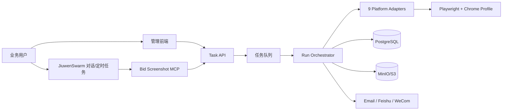
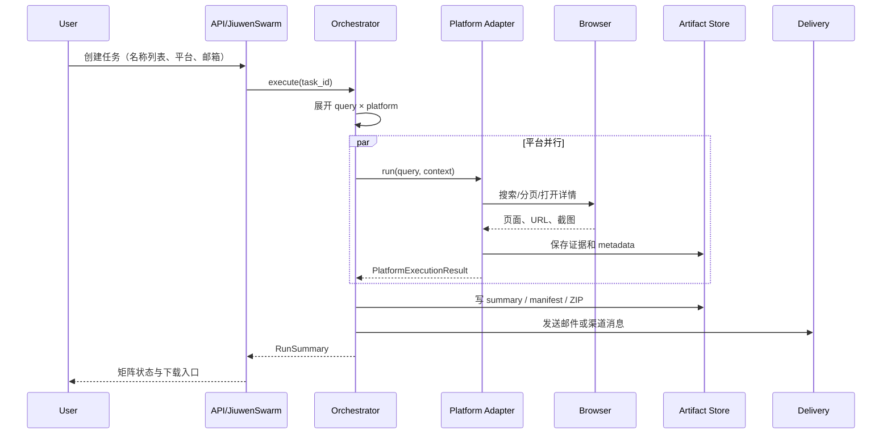

# 系统架构

- 状态：Accepted
- 日期：2026-07-20

## 1. 架构目标

- 业务系统与 JiuwenSwarm 解耦；
- 平台差异封装在 Adapter；
- 每个执行项可追踪、可恢复、可重试；
- 证据文件和结构化元数据同时保存；
- 支持立即执行、定时执行和人工接管。

## 2. 上下文

当前骨架使用内存 Task Store 和本地文件 Artifact Store，接口边界与未来组件一致。

## 3. 组件

### 3.1 Web/API

负责输入校验、任务管理、运行查询、证据索引和交付操作。API 不直接包含平台选择器。

### 3.2 Task Store

生产建议 PostgreSQL；当前基线为内存实现。持久化层需要保证：

- Task/Run/Item 独立状态；
- attempt 历史不可覆盖；
- 幂等键避免重复运行；
- 事务内写入状态和 outbox 事件。

### 3.3 Orchestrator

把任务展开为执行项，控制并发、超时、重试、降级、归档和交付。它只依赖 Adapter 协议，不依赖某个平台实现。

### 3.4 Platform Adapter

负责平台特定的会话准备、搜索、分页、候选提取、详情打开、证据采集和结果判定。Adapter 不发送邮件、不直接修改任务总状态。

### 3.5 Browser Runtime

生产使用 Playwright 连接专用 Chrome Profile。会话应按平台/账号隔离，验证码和风控进入人工接管。

### 3.6 Artifact Store

保存截图、PDF、HTML、元数据和归档。生产使用对象存储；本地使用文件目录。写入后立即计算 SHA-256。

### 3.7 JiuwenSwarm Integration

- Skill：定义何时使用标讯截图能力；
- SwarmFlow：负责输入解析、平台并行、校验和交付阶段；
- MCP/HTTP：把业务系统工具暴露给 Agent；
- Cron：定时监控和渠道推送。

## 4. 运行流程

## 5. 失败边界

- Adapter 错误：只影响对应执行项；
- Artifact 写入失败：执行项不能标记为证据成功；
- ZIP 失败：采集结果保留，运行状态标记交付准备失败；
- 邮件失败：交付失败，采集运行不回滚；
- 验证码：执行项暂停，保留 session/step，等待人工恢复；
- 页面变化：状态 `PAGE_CHANGED`，保留当前页面快照和可见关键词。

## 6. 部署演进

### Baseline

单进程 FastAPI + 内存存储 + 本地文件 + Mock Adapter。

### Pilot

FastAPI + PostgreSQL + Redis 队列 + 单机 Playwright Workers + MinIO + SMTP。

### Production

API/Worker 分离；平台级 Worker 池；账号/Profile 隔离；对象存储；指标告警；灰度 Adapter 版本；灾备与保留策略。
