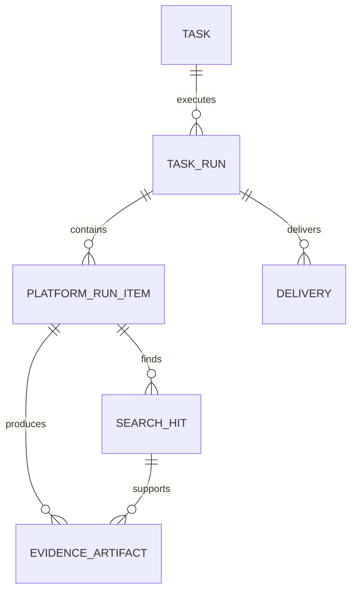

# 数据模型

- 状态：Accepted conceptually; persistence schema pending

## 1. 核心实体

### Task

用户定义的查询批次。

关键字段：`task_id`、`name`、`query_names`、`platform_ids`、`filters`、`recipients`、`created_at`、`status`。

### TaskRun

Task 的一次实际执行。重跑不会覆盖旧 Run。

关键字段：`run_id`、`task_id`、`attempt`、`started_at`、`finished_at`、`status`、`archive_uri`。

### PlatformRunItem

一个查询名称在一个平台的一次 attempt。

关键字段：`item_id`、`run_id`、`query_id`、`platform_id`、`attempt`、`status`、`current_step`、`duration_ms`、`feedback`、`browser_session_id`。

### SearchHit

平台返回的公告候选。

关键字段：`hit_id`、`item_id`、`title`、`source_url`、`published_at`、`notice_type`、`match_score`、`match_reason`。

### EvidenceArtifact

截图、PDF、HTML、SVG、JSON 或日志证据。

关键字段：`artifact_id`、`item_id`、`hit_id`、`kind`、`uri`、`sha256`、`captured_at`、`source_url`、`mime_type`、`size_bytes`。

### Delivery

邮件或渠道交付。

关键字段：`delivery_id`、`run_id`、`channel`、`recipients`、`status`、`sent_at`、`error`。

## 2. 关系

## 3. 标识与幂等

- 外部公开 ID 使用 UUID/ULID；
- `query_id` 基于任务内规范化名称生成，但保留原始名称；
- 执行幂等键建议：`task_id + schedule_tick + config_version`；
- 平台 item 唯一键建议：`run_id + query_id + platform_id + attempt`；
- 公告去重优先使用平台公告 ID，其次规范化 URL + 标题 + 发布日期指纹。

## 4. 状态分层

Task 状态不能直接等于某个 Item 状态：

- 全部完成且无技术失败：`COMPLETED`；
- 存在失败但有可用结果：`COMPLETED_WITH_ERRORS`；
- 等待验证码/登录：`WAITING_FOR_HUMAN`；
- 系统级无法继续：`FAILED`；
- 邮件失败由 Delivery 单独表达。

## 5. 证据不可变性

- Artifact 写入后不覆盖；
- 重试生成新的 attempt 路径；
- manifest 保存相对路径、哈希、大小和时间；
- 删除任务采用软删除，证据按保留策略异步清理；
- 任何重新打包都生成新的 archive 记录。
