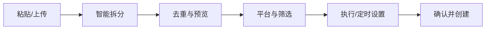

# UI/UX 设计说明

- 状态：Accepted baseline
- 详细视觉令牌见根目录 [`DESIGN.md`](../DESIGN.md)

## 1. 首要任务

用户进入系统后应快速完成两件事：

1. 批量创建任务；
2. 看懂九个平台执行矩阵并处理失败项。

## 2. 页面清单

- `/tasks`：任务列表；
- `/tasks/new`：新增任务；
- `/tasks/:id`：任务概览；
- `/runs/:id`：运行矩阵；
- `/runs/:id/items/:itemId`：平台执行详情；
- `/evidence`：证据库；
- `/platforms`：平台健康与登录管理；
- `/settings`：交付、并发、保留与审计设置。

## 3. 新建任务流程

任何自动识别结果都必须先预览，不直接静默入库。

## 4. 运行矩阵

- 固定左侧查询名称列；
- 每个平台一列；
- 单元格显示状态、耗时和命中数；
- 技术失败与未命中使用不同图标和文案；
- 顶部汇总：总项、完成、命中、未命中、人工处理、技术失败；
- 支持“只看异常”“只看有命中”“只看待人工”。

## 5. 执行抽屉

分区：

- 状态与反馈；
- 步骤时间线；
- 命中公告；
- 证据预览；
- 运行标识和技术信息；
- 重试/人工接管操作。

默认给业务人员易懂信息，技术细节折叠展示。

## 6. 原型阶段

当前根页面采用服务端静态 HTML，验证导航、任务输入和平台目录。正式前端建议 React + TypeScript，并直接消费稳定 API schema，不复制后端状态枚举。
